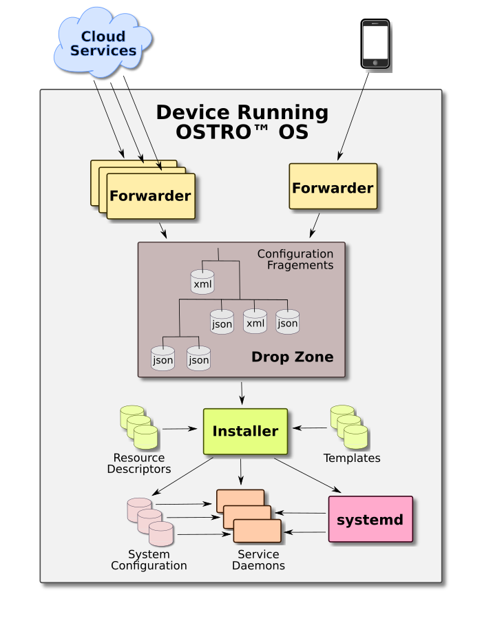

.. _configuration-and-management:

Configuration and Management of the Ostro |trade| OS
####################################################

Theory of Operation
===================

The Ostro OS configuration process is done in two major phase:

-  synchronization & delivery

-  installation

Agents that do synchronization & delivery related tasks are called
*Forwarders* while the agent that takes the actual configuration into
effect is the *Installer*.

The interface between Forwarders and the Installer is called the *Drop
Zone*. The Drop Zone is implemented as a directory tree, for example, under
``/var/cache/confs``. It hosts all the configuration data in various
configuration files called *Configuration Fragment*\'s .

The Configuration Fragments are either JSON or XML strings.
Future releases might also support .ini formatted strings.

   

..   :width: 350px
     :alt: Picture description           

Forwarders
----------

Forwarders are responsible for keeping the configuration
files in the Drop Zone updated, usually by syncing with some cloud maintained
data. Multiple Forwarders can be used simultaneously to maintain
configuration data subsets in the Drop Zone. An specific configuration file
should always be maintained by a single Forwarder.

The Drop Zone is a directory tree containing JSON or XML
formatted text files. These text files can be trivially mapped to hierarchical
key/value pairs where the key is the path to the Configuration
Fragment and the value is the fragment's JSON or XML
representation. In addition to the various file distribution
mechanisms and cloud based file sharing services, key/value tree based
distribution & synchronization systems (such as etcd) can also be used as
Forwarders.

The simplest Forwarder is the ``cp`` or ``scp`` utility that can be used
to deliver a Configuration Fragment into the Drop Zone. NFC agents
or etcd are examples of more complex Forwarders.

Forwarders using RESTful APIs can also be easily built. The Configuration
Fragments are the REST resources identified by the paths of the
actual files, and because the Configuration Fragments are stored in JSON or
XML, the CRUD operations are trivial.

The Installer
-------------

The task of the Installer is to generate the actual configuration
files, typically under ``/etc``, for the various Ostro OS software
components. The Installer tracks configuration data changes in the
Drop Zone using ``inotify``. When a Configuration
Fragment changes, the Installer reads the altered configuration
values and generates new versions of the affected configuration files
incorporating the new values. The configuration file generation is
template based.

A single value change in a Configuration Fragement might lead to the
re-generation of multiple configuration files of various Ostro OS
components. For instance, if the listening port of the SSH Daemon is
changed, the new value should be incorporated into the
``/lib/systemd/system/sshd.socket`` and ``/etc/sshd_config`` files, and
the Firewall rules should be modified too.

Each configuration file, that depends on configuration value changes,
needs to have a dedicated *Template* and a so called *Resource
Description* file. The Template is used to generate the configuration
file while the Resource Description specifies the context for the
operation:

-  the resulting configuration file (the output)
-  the template used to regenerate the output
-  regeneration triggers (a list of Configuration Fragments that
   trigger re-generation)
-  an optional executable program that can validate the generated configuration
   file
-  an optional executable program that can install the new configuration version, 
   for example, ``systemctl reload xxxx.service``

Data Model
==========

The tree of Configuration Fragments is composed of three subtrees
with an identical structure: Factory, Common,  and Local.

* The Factory subtree contains the default values of the Ostro OS
  distribution. This subtree is part of the OS image and is
  immutable.

* The Common subtree hosts the values that are common for a larger set
  of systems. For instance, a service provider who maintains a large
  number of Ostro OS based systems could store configuration values under
  the Common subtree that are identical (and hence common) for all systems.

* The Local subtree meant for individual Ostro OS device-specific
  configuration values. Configuration values under the Local subtree can
  be set either remotely by Service Providers or locally by end-users
  using their phones, tablets, or laptops. (WLAN SSID is an example
  of locally set configuration data.)

Templates offer mechanisms to deep-merge these subtrees in increasing
priority order of Factory, then Common, and finally Local. The deep-merge
means that the merging is done on individual configuration value level as
opposed to Configuration Fragment level.

Components
==========

The Ostro OS Configuration & Management system is an optional yocto layer 
called ``meta-configuration``.  This layer contains

-  an Installer,

-  some optional (and example) Forwarders,

-  a simple Web UI, called Base UI,  that can be used to maintain values
   in the Local subtree

-  some infrastructure for example, to set up the Drop Zone, and

-  configuration packages for the main Ostro OS components such as
   ``connman``, and ``openssh``.  For instance for the ``connman`` package,
   the ``meta-configuration`` layer provides the ``connman-conffw`` package.

Pulling in the ``meta-configuration`` layer does not automatically pull
the component configuration packages. These
packages should be explicitly pulled in by editing your
``local.conf`` file.

The configuration packages typically contain

-  one or more Templates and Resource Descriptions to generate
   configuration files

-  optional factory defaults for the package, Configuration
   Fragments that go to the Factory subtree)

-  optional executable programs to check and install the configuration data

-  optional support files for stateless operation. These files are
   installed under ``/usr/lib/tmpfiles.d`` and used to set up or copy files to
   ``/etc`` or ``/var`` by ``systemd-tmpfiles``

-  optional JavaScript / JSON files for generating Base UI pages. 

The Configuration & Management Framework supports polymorphism to
some extent. Consider the replacement of the ``openssh`` package with
``dropbear``. The ``dropbear-conffw`` package will bring in its own
Templates and Resource Descriptors and without changing any
Configuration Fragments in the Drop Zone, the correct configuration
files will be generated so that the same port could be used for
``dropbear ssh`` logins as was used for ``openssh``.

Stateless Operation
===================

The Ostro OS Configuration Framework fully supports stateless operation;
everything under ``/etc`` or ``/var`` is
generated or copied from somewhere else.

Drop Zone
---------

The Drop Zone root is ``/var/cache/confs``. As we stated earlier, under
this root there are three identical subtrees: Factory, Common,  and
Local. The Factory subtree is populated by configuration packages
intended as immutable and persistent, since it holds the
configuration values for factory resets. On the other hand Common and
Local trees should be empty after a factory reset.

Consequently, the configuration packages install the default values of
the distribution under ``/usr/share/factory/confs`` which is symlinked
to ``/var/cache/confs/factory`` providing a single directory
tree for the Installer.

After first boot or a factory reset, ``systemd-tmpfiles`` is used to build
the initial Drop Zone directory hierarchy, creating the necessary
directories and symlink ``/usr/share/factory/confs`` to
``/var/cache/confs/factory.`` The basic configuration package installs a
file under ``/usr/lib/tmpfiles.d`` to let this happen. The rest of the Drop
Zone, (the Common and Local subtrees), will be populated by the
various Forwarders (typically fetching data from cloud services).

Systemd
-------

When the component configuration packages need to modify their service-,
socket- or other systemd configuration files, they edit the original
file, under ``/lib/systemd/..`` and save the modified version 
with different configuration values under ``/etc/systemd/...``.  They
specify ``systemctl daemon-reload`` for the installation command 
in their Resource Descripton.

Templates typically use regexp to edit the original file.
